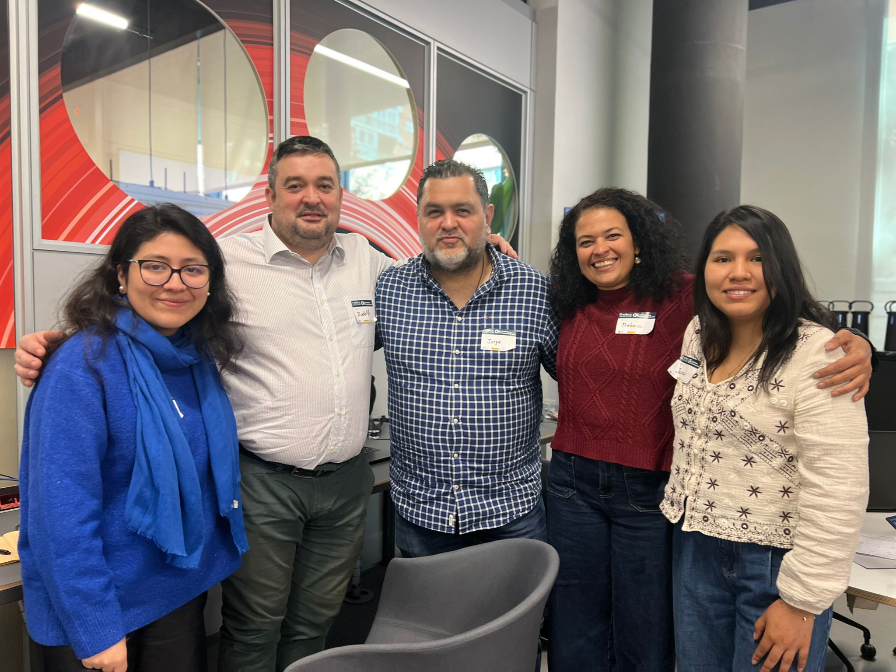

# Asistente Personal WhatsApp para Personas Mayores

Asistente conversacional por WhatsApp diseñado para **aumentar la autonomía de personas mayores en la ciudad**. Permite gestionar la compra semanal, descubrir rutas de paseo y consultar eventos cercanos — todo por voz o texto, sin instalar ninguna app.

Desarrollado como MVP en el contexto de un hackathon. Integra WhatsApp como canal principal porque es la herramienta que las personas mayores ya usan y conocen.

---

## Demo en vivo

<div align="center">
  
  <br><br>
  <em>Demo completa en video: <a href="video/demo.mp4">demo.mp4</a></em>
</div>

---

## ¿Qué puede hacer?

Al iniciar la conversación el bot presenta un menú con 3 opciones:

```
🛒 Hacer la compra
📋 Cosas pendientes   (próximamente)
💡 Qué hacer hoy
```

### 🛒 Flujo de compra

1. El usuario pulsa **Hacer la compra** o lo dice por voz o texto
2. El bot genera la lista habitual personalizada con GPT-4o-mini
3. Se presentan 3 botones: **✅ Confirmar · ✏️ Modificar · ❌ Cancelar**
4. El usuario puede modificar por voz: *"sin yogures"*, *"añade más leche"*
5. Al confirmar: el usuario recibe la fecha/hora de entrega y el familiar de confianza recibe un aviso automático

### 💡 Flujo de actividades — Qué hacer hoy

El bot pregunta si prefiere un **paseo** o un **evento**:

**Opción paseo** — 2 rutas con foto, descripción y botón de navegación:
- Parque Enrique Tierno Galván (~25 min andando)
- Centro Cultural Casa del Reloj (~10 min andando)

**Opción evento** — 3 planes con foto, horario y botón de cómo llegar:
- Exposición Nuevas Cleopatra · Matadero Madrid · 17:00–21:00
- Charla sobre Conciencia · Centro Cultural Las Doroteas · 12:00
- Concurso de Bachata · Discoteca Paraíso · hasta las 00:00

Al confirmar cualquier actividad, el familiar de confianza recibe un aviso discreto con el plan elegido.

### 🎙️ Soporte completo de voz

Cualquier interacción puede hacerse por audio de voz. El bot transcribe automáticamente con OpenAI Whisper y procesa el mensaje como texto.

---

## Inteligencia Artificial — cómo y dónde se usa

La IA no es solo un componente auxiliar: es el núcleo que permite que la experiencia sea completamente natural. El usuario **nunca tiene que aprender comandos ni navegar menús** para las acciones principales.

### 🎙️ Transcripción de voz — OpenAI Whisper

Cada mensaje de audio enviado por WhatsApp se transcribe en tiempo real antes de procesarse. Esto permite que el usuario hable con naturalidad, con acento, pausas o errores de pronunciación, y el sistema lo entiende igual.

### 🧠 Detección de intención — GPT-4o-mini

Cuando el usuario escribe o dice algo en estado libre, el modelo clasifica automáticamente la intención:

```
"Quiero hacer la compra"        → PURCHASE_INTENT
"Necesito pedir algunas cosas"  → PURCHASE_INTENT
"Hola buenas"                   → UNKNOWN
```

No hay un menú de comandos que memorizar. El usuario habla como lo haría con una persona y el sistema interpreta qué quiere hacer.

### 🛒 Generación de lista personalizada — GPT-4o-mini

Al detectar intención de compra, el modelo genera automáticamente la lista de la semana combinando:
- La lista habitual del usuario (sus productos frecuentes con cantidades y precios)
- Lo que ha dicho en el mensaje (puede pedir algo concreto)

El resultado es una lista formateada por categorías con precios y total estimado, lista para confirmar.

### ✏️ Modificación por lenguaje natural — GPT-4o-mini

Esta es la capacidad más relevante para la autonomía del usuario: **no hay formularios ni menús de edición**. El usuario simplemente dice lo que quiere cambiar:

```
"Sin yogures"
"Añade dos bricks de leche más"
"Quita el pollo y pon merluza"
"Que sean plátanos de Canarias"
```

El modelo reescribe la lista completa aplicando los cambios indicados, manteniendo el resto intacto. El usuario puede repetir este ciclo tantas veces como quiera antes de confirmar.

---

## Máquina de estados

```
                        ┌─────────────────────────────────────┐
                        │               IDLE                  │
                        │  (cualquier mensaje → menú inicial) │
                        └────┬──────────────┬─────────────────┘
                             │              │
                    [🛒 compra]      [💡 actividades]
                             │              │
                             ▼              ▼
               AWAITING_CONFIRMATION   ACTIVIDADES_ELIGIENDO
                    │    │    │              │           │
               ✅   ✏️   ❌         [paseo]       [evento]
                |    |    |              │               │
           IDLE  MODIFYING IDLE   ACTIVIDADES_PASEO  ACTIVIDADES_EVENTO
                    │                   │               │
               (texto)            [elige ruta]   [elige evento /
                    │                   │         botón Cómo llegar]
                    ▼                   ▼               │
           AWAITING_CONFIRMATION      IDLE            IDLE
                                  + notifica        + notifica
                                    familiar          familiar
```

---

## Stack tecnológico

| Componente | Tecnología |
|---|---|
| Servidor | Python 3.11 + FastAPI + uvicorn |
| Canal WhatsApp | Woztell WhatsApp API |
| Inteligencia artificial | OpenAI GPT-4o-mini |
| Transcripción de voz | OpenAI Whisper (`whisper-1`) |
| Hosting | Railway (deploy automático desde GitHub `master`) |
| Imágenes estáticas | FastAPI StaticFiles |

---

## Estructura del proyecto

```
main.py              # FastAPI app, webhook, orquestación de estados
config.py            # Configuración desde variables de entorno
woztell.py           # Cliente Woztell: send_text, send_reply_buttons, send_image
ai_processor.py      # GPT-4o-mini: detección de intención, generación y modificación de lista
audio_processor.py   # Descarga audio (REST + GraphQL Woztell) + transcripción Whisper
conversation.py      # Estado en memoria por número de teléfono
shopping_list.py     # Lista habitual de ejemplo + format_summary + calcular_total
actividades.py       # Datos de rutas y eventos + detección de elección por keywords
pendientes.py        # Stub — cosas pendientes (pendiente de implementar)
img/                 # Fotografías de rutas y eventos
video/               # Demo grabada del funcionamiento
tests/               # Suite de tests con pytest-asyncio
docs/superpowers/    # Especificación de diseño del hackathon
Procfile             # web: uvicorn main:app --host 0.0.0.0 --port $PORT
runtime.txt          # python-3.11.9
.env.example         # Plantilla de variables de entorno requeridas
```

---

## Configuración local

### 1. Variables de entorno

Copia `.env.example` a `.env` y rellena los valores:

```bash
cp .env.example .env
```

| Variable | Descripción |
|---|---|
| `OPENAI_API_KEY` | Clave de la API de OpenAI |
| `WOZTELL_ACCESS_TOKEN` | JWT de acceso a la API de Woztell |
| `WOZTELL_CHANNEL_ID` | ID del canal WhatsApp en Woztell |
| `TELEFONO_USUARIO` | Teléfono del usuario principal (formato: `34XXXXXXXXX`) |
| `TELEFONO_FAMILIAR` | Teléfono del familiar de confianza |
| `NOMBRE_USUARIO` | Nombre del usuario (ej: `Antonio`) |
| `NOMBRE_FAMILIAR` | Nombre del familiar (ej: `María`) |
| `BASE_URL` | URL pública de la app para servir imágenes |
| `USE_MOCK_AI` | `true` para modo mock sin llamar a OpenAI |

### 2. Instalar dependencias

```bash
pip install -r requirements.txt
```

### 3. Arrancar el servidor

```bash
uvicorn main:app --reload --port 8000
```

### 4. Exponer con ngrok para recibir webhooks

```bash
ngrok http 8000
# Configura la URL generada como webhook en Woztell:
# https://xxxx.ngrok.io/webhook
```

---

## Tests

```bash
pytest tests/ -v
```

---

## Despliegue en Railway

1. Fork del repositorio
2. Crear proyecto en [Railway](https://railway.app) conectado al repositorio
3. Añadir las variables de entorno del `.env.example` en el panel de Railway
4. Railway despliega automáticamente en cada push a `master`

---

## Endpoints disponibles

| Endpoint | Método | Descripción |
|---|---|---|
| `/health` | GET | Estado de la app |
| `/webhook` | POST | Recibe mensajes de Woztell (texto, audio, botones) |
| `/img/{archivo}` | GET | Sirve imágenes estáticas de rutas y eventos |
| `/debug/payloads` | GET | Últimos 10 webhooks recibidos |
| `/debug/file/{fileId}` | GET | Diagnóstico de descarga de audio |
| `/make/trigger` | POST | Stub para integración futura con Make |

---

## Roadmap — Próximas funcionalidades

### 📋 Cosas pendientes
Gestión de tareas y recordatorios personales del usuario.

### 🛡️ Modo Salida — El guardián invisible
Cuando el usuario confirma una actividad, el sistema activa un protocolo de acompañamiento silencioso:
- Check-in amigable a mitad del tiempo estimado
- Verificación de vuelta a casa al finalizar
- Alerta discreta al familiar si no hay respuesta pasado un margen
- Confirmación tranquilizadora al familiar cuando el usuario vuelve

El objetivo es romper el ciclo de restricción familiar → autoaislamiento, permitiendo más salidas independientes con una red de seguridad invisible y no estigmatizante.

### 🚌 Guía de transporte público en tiempo real
Acompañamiento paso a paso por metro o autobús vía WhatsApp: *"Sal en la próxima parada, Legazpi"*. Multiplica drásticamente los destinos accesibles de forma independiente.

### 👥 Compañía espontánea
Conexión con otros usuarios de la zona que quieren hacer la misma actividad, combinando autonomía con reducción de la soledad.

---

## Equipo

<div align="center">
  
</div>

<br>

<div align="center">

| Participante | LinkedIn |
|:---:|:---:|
| **Rodolfo López** | [linkedin.com/in/rodolfomiguel](https://www.linkedin.com/in/rodolfomiguel/) |
| **Rebeca Castillo** | [linkedin.com/in/rebecacastillodragone](https://www.linkedin.com/in/rebecacastillodragone) |
| **Jorge Escobar** | [linkedin.com/in/jorge-a-escobar-g-590241112](https://www.linkedin.com/in/jorge-a-escobar-g-590241112) |
| **Jazmín Ríos** | [linkedin.com/in/jasminrios](https://www.linkedin.com/in/jasminrios/) |
| **Ingrid Maldonado** | [linkedin.com/in/ingrid-salvador-maldonado](https://www.linkedin.com/in/ingrid-salvador-maldonado/) |

</div>
